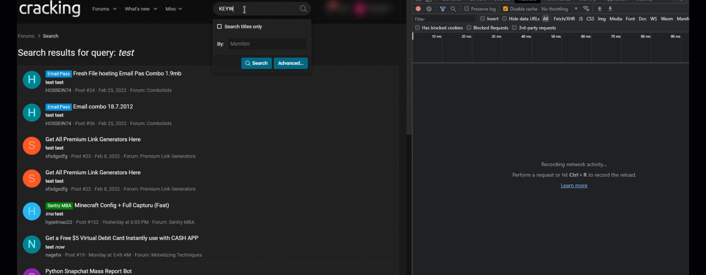
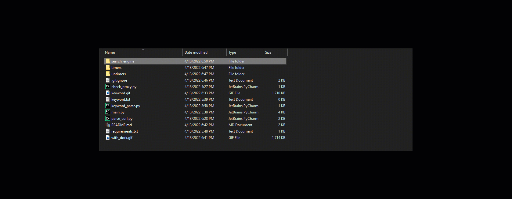
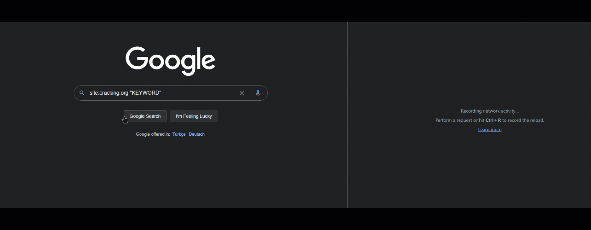

# Darkweb Forum && Keyword Scanner
It's a simple tool that can be used to scan the Darkweb for keywords.

#### How to use:
```text
Clone Repository: git clone https://github.com/Batmanly/DFScan
Install Dependencies: pip install -r requirements.txt
Run: python3 main.py
```

For usage, you must add your forum CURL Request in the folder as the shown in the example.

Search KEYWORD must be KEYWORD in the CURL Request.Be Carefully !!!
Open Chrome Tools with F12 and click the "Network" tab. Than Copy Post Request as curl/bash.

Than add this curl to inside the folder. as a with name you want.
You can add keyword,url etc. that you want to search in to keyword.txt file.
For use with Tor relay you must start tor service.

### Folders
There is three folders in the project.
For each folder there is one thread is working , in the timers folder forum has to wait for 40 second for each new tab, because some websites has limit for scan keyword.

if your forum doesn't have limit for scanning you must and untimers folder your curl request.
you can add search engine in the search engine tab with dork and keyword. some forum doesn't let you scan 3-4 lenght keyword , so you can use google dork for this keywords.


as like before add curl command to in the search engine folder with the name you want.

```text
For Windows and Mac: https://github.com/jeremy-jr-benthum/onion-browser-button/releases you can use this.
```


